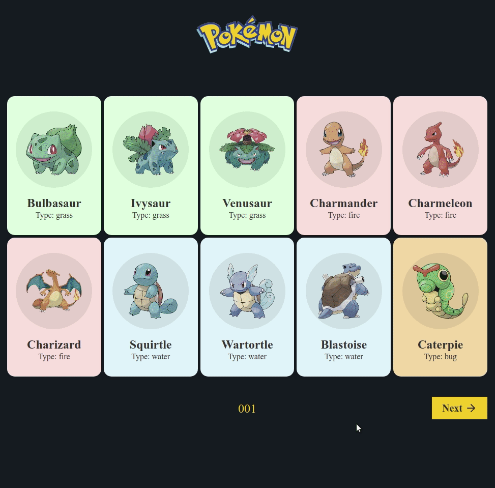

<h1>

 
Pokédex
</h1>
<h2>
A simply Pokédex application with pagination.
</h2>

This application uses the <a href="https://pokeapi.co/" target="_blank">PokéAPI</a>

 

  

<h2>Application</h2>
 

  

  

## Technologies

This project was developed with the following technologies:

- [ReactJS](https://reactjs.org/)
- [TypeScript](https://www.typescriptlang.org/)
- [react-router-dom](https://reactrouter.com/)
- [styled-components](https://www.styled-components.com/)